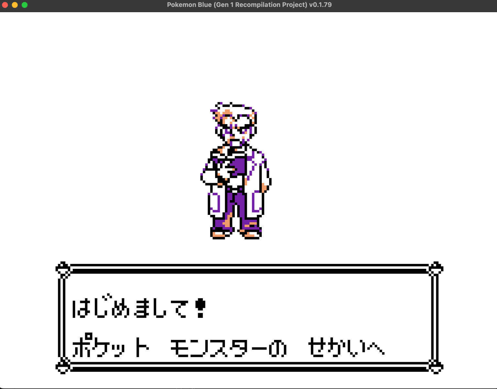
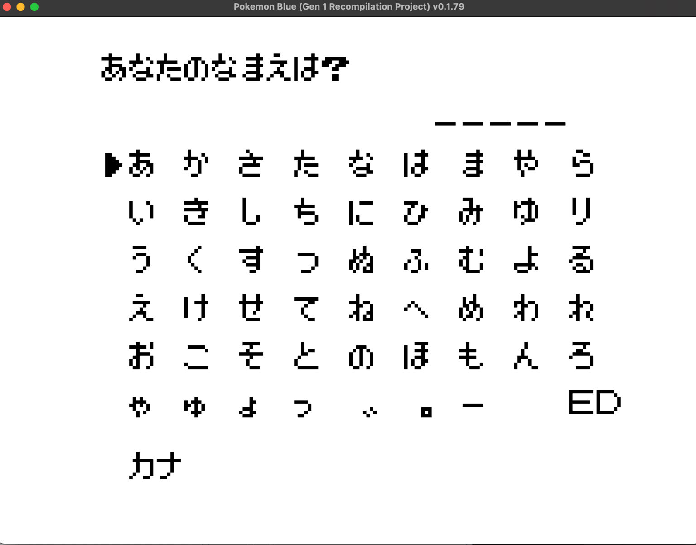
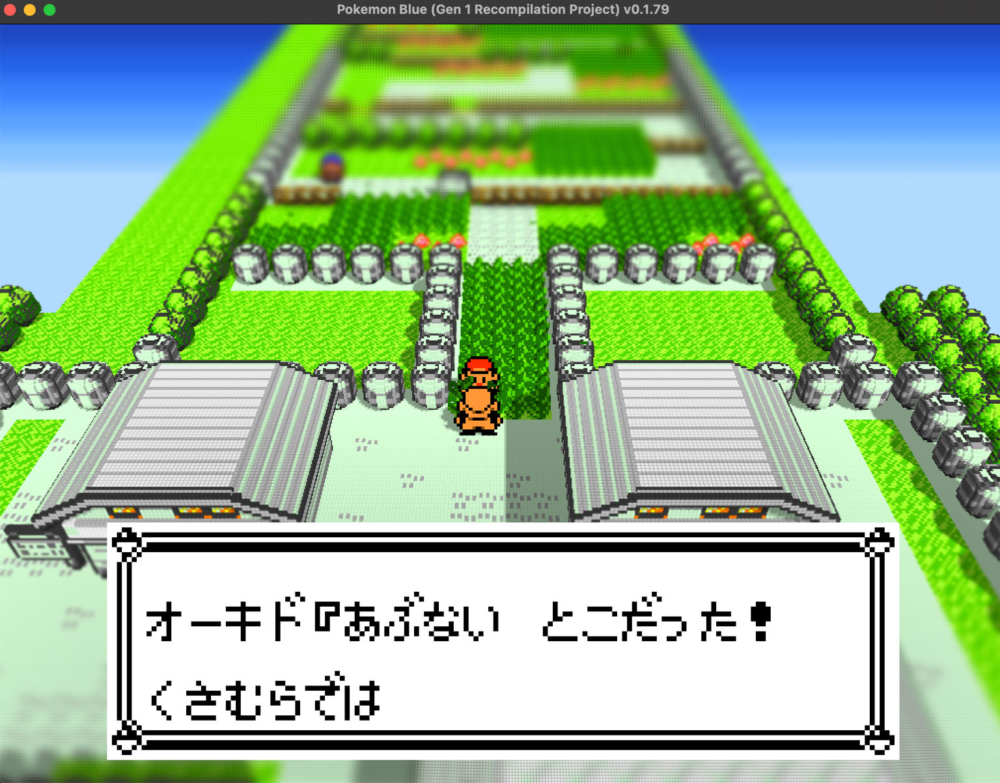
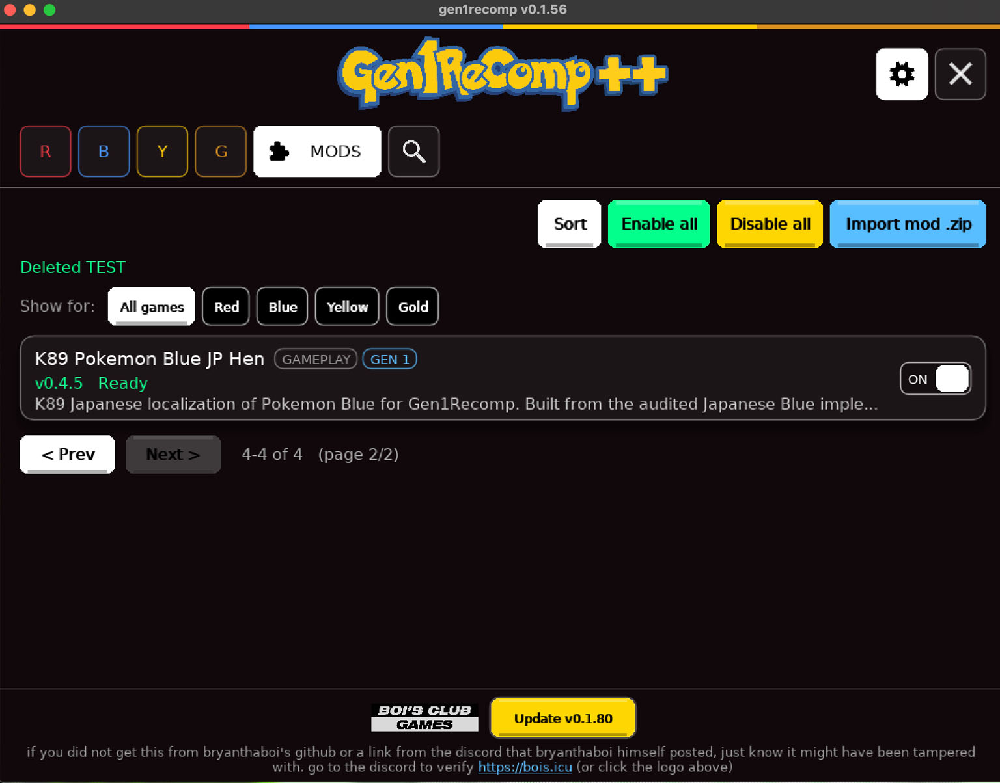

# K89 Pokémon Blue JP

Gen1Recomp版『Pokémon Blue』を日本語化するための非公式MODです。

> **重要:** このMODは **Pokémon Blue専用** です。Pokémon Redには対応していません。

日本版『ポケットモンスター 青』を基に、ゲーム内テキスト、ポケモン名、わざ名、メニュー、マップ名などを日本語化しています。

## 現在のバージョン

**v0.4.5 Beta**

現在は公開ベータ版です。

主要なゲーム内テキストの日本語化、日本語フォント表示、マップ名、メニュー、名前入力画面などに対応しています。

ただし、ゲーム全体のすべての状況について確認が完了しているわけではありません。
一部に未翻訳のテキスト、表示位置の問題、表記の不一致、その他の不具合が残っている可能性があります。

## スクリーンショット

### オーキド博士との会話

### 名前入力画面

### ゲーム画面

### バトル画面

## インストール

配布用ZIPは **[Releases](https://github.com/yaizoo/K89-Pokemon-Blue-JP/releases)** からダウンロードしてください。

1. Releasesから最新版の `K89-Pokemon-Blue-JP-...zip` をダウンロードします。
2. ZIPファイルを展開します。
3. `K89_POKEMON_BLUE_JP_HEN` フォルダをGen1Recompの `mods` フォルダに入れます。
4. Gen1Recompを起動します。
5. MOD一覧から **K89 Pokemon Blue JP Hen** を有効にします。
6. Pokémon Blueを起動します。

> **注意:** GitHub上部の「Code」→「Download ZIP」ではなく、**Releasesから配布用ZIPをダウンロードしてください。**

## 対応環境

- Gen1Recomp
- Pokémon Blue
- Pokémon Red：**非対応**

このMOD単体ではゲームを起動できません。

また、このリポジトリおよび配布ZIPにはPokémon BlueのROMは含まれていません。

## 不具合報告

未翻訳箇所、文字化け、表示位置の問題、クラッシュなどを発見した場合は、GitHub Issuesから報告してください。

可能であれば、以下の情報を添えてください。

- スクリーンショット
- 発生した場所
- 発生した状況
- 使用しているGen1Recompのバージョン
- 問題を再現するための手順

皆さんからの報告は、日本語化の完成度向上に役立ちます。

## 開発支援

K89 Pokémon Blue JPは無料で公開しています。

開発、テスト、日本語化作業を支援していただける場合は、暗号資産での寄付を受け付けています。

寄付は完全に任意です。MODのダウンロードおよび利用に支払いは必要ありません。

**BTC**

`1P2xDJC99Jx4th5kXpwW1Jeg4uaw29Racm`

**ETH**

`0xa6d631b2984A0C1d93f3ADD828Ff204DC3272bF0`

**XMR**

`41sgKb1BLfz535b5bfspbQQB9RoeYzELDDNWraqAemsPcY32MXtQj1BXKb92pqmUTTBL3sEB29bRfd7xTN98e45rHjvDK9n`

**XRP**

`rDyA6b4FeEiAkVVhnos9QJReRxA1VgVsD7`

Destination Tag：不要

ご支援ありがとうございます。

## 注意事項

このMODは非公式のファンプロジェクトです。

任天堂、株式会社ポケモン、ゲームフリーク、その他の権利者とは関係ありません。

Pokémon、ポケットモンスター、および関連する名称・コンテンツの権利は、それぞれの権利者に帰属します。

このプロジェクトはROMを配布するものではありません。
